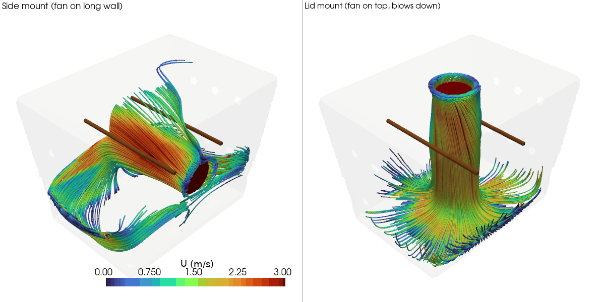

# Experiment 1: fan mount placement

**Question:** should the 80mm intake fan go on a long side wall, or on the
lid blowing straight down? Both variants vent out the same 12-hole grid
split across both short faces, so fan position is the only thing that
differs between them.

- `side_mount` - fan on one long wall, blowing across the short axis
- `lid_mount` - fan on the lid, blowing straight down

Physics: steady RANS (`simpleFoam` + `kOmegaSST`), isothermal, fan modeled
as a fixed-velocity inlet at a representative 80mm-fan free-air rating
(~30 CFM -> ~3.7 m/s). See `setup_cfd_cases.py` for every assumption/constant
in one place.

## Finding

| metric | side_mount | lid_mount |
|---|---|---|
| mean speed at rod/meat surface | **0.72 m/s** | 0.56 m/s |
| min / max at rod surface | 0.10 / 2.69 m/s | 0.09 / 1.04 m/s |
| cross-section uniformity (CV, lower = more even) | **0.89** | 0.97 |

**side_mount wins on average airflow** over the meat and is slightly more
even across the whole cross-section. The catch: its higher average comes
from a wider spread rod-to-rod (0.10-2.69 m/s - the near rod gets blasted,
the far one much less), while lid_mount is weaker overall but splits more
evenly between the two rods. So side_mount dries faster on average;
lid_mount is more forgiving if even drying between the two rods matters
more than raw speed.

Streamlines also show *why*: in both variants the fan's jet axis is 90°
off from the vent axis (vents are on the short-axis end faces in both
cases), so air has to fill/recirculate through the box rather than sweep
straight to an exit. That's the next thing worth testing (see the repo
root README for what's queued up next).

**Caveat:** outlet outflow came out to ~83-84% of fan inflow in the
post-hoc flux check (same gap for both variants) - not a real leak, just
solver residuals not fully flat at 500 iterations plus some approximation
in how the flux was estimated from the saved field. Doesn't change the
comparison since it affects both variants equally.

## Reproduce

```
python3 setup_cfd_cases.py                 # writes case-side-mount/, case-top-mount/
./run_cfd.sh side_mount                    # mesh + solve (~7-15 min depending on load)
./run_cfd.sh lid_mount
./compare.sh                               # writes results/
```
(`compare.sh`/`view.sh` find the shared `.venv` automatically - run them
from anywhere, no activation or path-remembering needed)

## View the results

- **Quick look (static images):** open the PNGs directly in `results/`:
  `velocity_slice.png`, `rod_height_slice.png`, `streamlines.png` (each is
  side_mount vs lid_mount side by side), plus `metrics.csv` for the raw
  numbers.
- **Interactive (rotate/zoom/pan):**
  ```
  ./view.sh slice         # velocity, vertical mid-plane
  ./view.sh rods          # velocity at rod height
  ./view.sh streamlines   # fan-seeded streamlines
  ./view.sh all           # all three, one after another
  ```
  Both variants' cameras are linked, so rotating one rotates the other.
  Close a window to move to the next.
- **Rotating GIF (e.g. for a GitHub README, which can't render the
  interactive viewer):**
  ```
  ./make_gif.sh                      # writes results/streamlines.gif
  ./make_gif.sh rods                 # orbit the rod-height slice instead
  ./make_gif.sh slice --frames 90 --fps 20   # smoother, bigger file
  ```
  

## Files

```
generate_geometry_v2.py    Blender geometry generator -> stl_out/<variant>/*.stl
setup_cfd_cases.py         writes OpenFOAM case files (0/, constant/, system/) + copies STLs
run_cfd.sh                 blockMesh -> snappyHexMesh -> checkMesh -> simpleFoam, via Docker
compare_variants.py        metrics + comparison renders -> results/
compare.sh                 wrapper: runs compare_variants.py with the shared .venv, from anywhere
view_interactive.py        interactive viewer (reuses compare_variants.py's helpers)
view.sh                    wrapper: runs view_interactive.py with the shared .venv, from anywhere
make_gif.py                orbiting-camera GIF export (for GitHub embedding) -> results/*.gif
make_gif.sh                wrapper: runs make_gif.py with the shared .venv, from anywhere
preview_variant.py         quick color-coded geometry-only preview (no CFD), pre-meshing sanity check
stl_out/                   geometry STLs per variant (walls/fan/outlet/rods patches)
case-side-mount/           OpenFOAM case for side_mount (mesh + solution, regenerable)
case-top-mount/            OpenFOAM case for lid_mount (mesh + solution, regenerable)
results/                   metrics.csv + comparison PNGs
```
