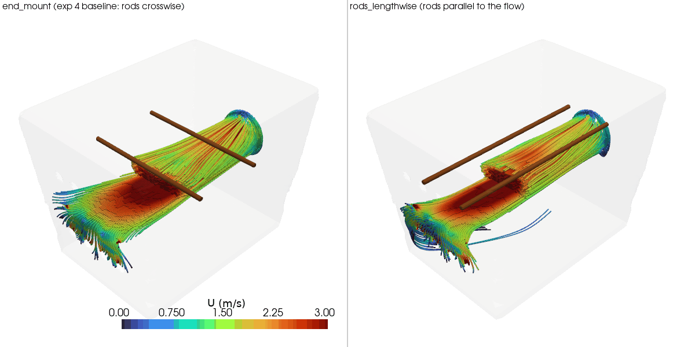

# Experiment 5: rod orientation - lengthwise vs crosswise

**Question:** every experiment so far (1-4) has kept the two rods running
crosswise - along y, perpendicular to whichever way that variant's air
flows. What if the rods run lengthwise instead - along x, parallel to the
flow - so air slides along their length instead of hitting them broadside?
This experiment isolates rod orientation as its own variable, holding fan
and vent placement fixed at experiment 4's end_mount layout (the one
variant where the flow direction, x, is distinct from the rods' default
axis, y, so rotating the rods actually changes something relative to that
flow).

- `end_mount` - exp 4's variant, reused as-is (not re-solved): fan on the
  -x short face blowing in +x, all 12 vents consolidated on the opposite
  +x short face, rods crosswise (along y) at two x positions
- `rods_lengthwise` - identical fan/vent layout, rods rotated 90 degrees to
  run along x (parallel to the flow) at two y positions instead. Rod
  orientation is the only variable - fan speed, vent size/count, box
  geometry, and fan/vent placement are all unchanged.

## Finding: mixed result - rod-surface average improves, but at the cost of evenness (both along the rod and across the box)

| metric | end_mount (rods crosswise) | rods_lengthwise |
|---|---|---|
| mean speed at rod/meat surface | 0.598 m/s | **0.685 m/s** (+15%) |
| min speed at rod/meat surface | 0.100 m/s | **0.036 m/s** (-65%) |
| std dev at rod/meat surface (lower = more even along the rod) | **0.447 m/s** | 0.538 m/s (+20%) |
| mean speed, full cross-section at rod height | **0.514 m/s** | 0.445 m/s (-13%) |
| uniformity (CV, lower = more even) | **0.75** | 0.82 |
| internal gauge pressure (mean / max) | 14.4 / 20.7 Pa | 13.9 / 20.6 Pa (essentially unchanged) |
| rod 1 / rod 2 mean speed | 0.557 / 0.639 m/s | 0.622 / 0.748 m/s |

The headline number moves the "right" way - average speed right at the
meat surface is up 15% - but every other metric moves the wrong way. The
minimum speed anywhere on a rod's surface drops by nearly two-thirds (to
0.036 m/s, essentially stagnant), and the std dev across each rod's surface
is up 20%, meaning a lengthwise rod has a much wider spread of fast and
slow spots along its own length than a crosswise rod does. For biltong,
where the whole strip should dry at a similar rate, "higher average but a
dead patch somewhere on every rod" is not obviously an improvement over
"lower average but fairly consistent along the rod." The full-cross-section
numbers agree it's not a clean win: both the mean speed and the uniformity
at rod height get worse when measured over the whole horizontal slice, not
just at the rods.

**Why:** the rod-height slice (`results/rod_height_slice.png`) shows the
mechanism. The fan's jet forms a hot core roughly centered on the box's
mid-width (y=0). Crosswise rods, spanning the full width at a fixed x, are
*forced* to cross directly through wherever that core sits - they always
intersect the fastest part of the flow, for better (higher mean) or worse
(more blockage/drag on the whole jet). Lengthwise rods, positioned at fixed
y offsets (the same 1/3, 2/3 fractions used for x-placement, now applied to
the width instead), ended up straddling the jet symmetrically rather than
sitting in its densest core - visible in the slice as the two rods flanking
a central channel rather than crossing it. Streamlines
(`results/streamlines.png`) show the same thing from another angle: in
rods_lengthwise the core jet tube passes largely undisturbed between the
two rods instead of being broken up by them.

**Caveat worth flagging:** this means the test isn't a perfectly clean
isolation of "orientation only" - reusing the 1/3, 2/3 fraction convention
shifted the rods' position relative to the jet centerline as a side effect
of the rotation, not just their angle. A fairer follow-up would center the
lengthwise rods symmetrically on the jet's actual centerline (or run them
at y=0 and some offset instead of ±1/3) before drawing a final conclusion
about orientation in isolation. Separately, the two lengthwise rods aren't
quite symmetric either (0.622 vs 0.748 m/s mean, despite sitting at
symmetric y positions in a nominally symmetric box) - the same kind of
rod-to-rod asymmetry (0.557 vs 0.639 m/s) already exists in the crosswise
baseline, and neither run's residuals converged to the solver's target
before hitting the 500-iteration cap (same as every other case in this
project), so some of this asymmetry is solver/mesh noise rather than a
real physical effect. Read the 15% mean-speed gain with that noise floor in
mind - it's not dramatically larger than the rod-to-rod scatter already
present within a single variant.

**Recommendation:** no change on the strength of this result alone. The
mean-speed gain is real but modest and comes with a worse minimum and worse
evenness both along each rod and across the box - not a convincing trade
for a home dehydrator box that wants everything drying at roughly the same
rate. If rod orientation is worth revisiting, it should be with the rods
re-centered on the jet rather than reusing the crosswise placement
convention verbatim.

## View the results (rendered)

`results/rod_height_slice.png` is the clearest evidence: the crosswise rods
sit squarely in the jet's hot core, while the lengthwise rods flank a
largely undisturbed central channel.



## Reproduce

```
blender --background --python generate_geometry_v2.py   # writes stl_out/rods_lengthwise/
python3 setup_cfd_cases.py                                # writes case-rods-lengthwise/
./run_cfd.sh rods_lengthwise                               # mesh + solve (~6-10 min)
./compare.sh                                                # writes results/ (reuses exp4's end_mount, no re-solve)
```
(`compare.sh`/`view.sh` find the shared `.venv` automatically - run them
from anywhere, no activation or path-remembering needed)

## View the results

Same pattern as previous experiments: static PNGs in `results/`, or
```
./view.sh all
```

To generate a rotating GIF (e.g. for embedding in a GitHub README, which
can't render the interactive viewer):
```
./make_gif.sh                      # writes results/streamlines.gif
./make_gif.sh rods                 # orbit the rod-height slice instead
./make_gif.sh slice --frames 90 --fps 15   # faster playback, bigger file
```
Default is 7.5fps (deliberately slow, easier to follow the rotation);
pass `--fps` to override.

## Files

```
generate_geometry_v2.py    Blender geometry generator -> stl_out/rods_lengthwise/*.stl
setup_cfd_cases.py         writes OpenFOAM case files (0/, constant/, system/) + copies STLs
run_cfd.sh                 blockMesh -> snappyHexMesh -> checkMesh -> simpleFoam, via Docker
compare_variants.py        metrics + comparison renders -> results/
compare.sh                 wrapper: runs compare_variants.py with the shared .venv, from anywhere
view_interactive.py        interactive viewer (reuses compare_variants.py's helpers)
view.sh                    wrapper: runs view_interactive.py with the shared .venv, from anywhere
make_gif.py                orbiting-camera GIF export (for GitHub embedding) -> results/*.gif
make_gif.sh                wrapper: runs make_gif.py with the shared .venv, from anywhere
stl_out/                   geometry STLs for rods_lengthwise (walls/fan/outlet/rods patches)
case-rods-lengthwise/      OpenFOAM case for rods_lengthwise (mesh + solution, regenerable)
results/                   metrics.csv + comparison PNGs
```
