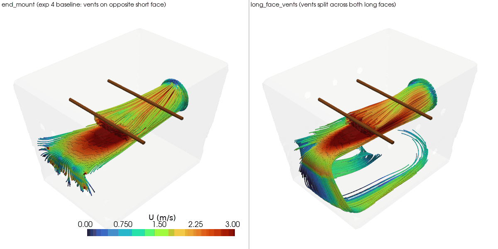

# Experiment 6: vent placement - long faces vs the single opposite short face

**Question:** experiment 4's end_mount (fan on a short END face, blowing
down the long axis) consolidated all 12 vents onto the single short face
directly opposite the fan - the "aligned" placement that experiments 2 and
4 both found loses to a "perpendicular" placement (vents on faces the jet
isn't pointed straight at, forcing the flow to fill/circulate through the
box before it can escape). Neither of those two experiments tried
perpendicular placement for *this* fan orientation, though - does moving
end_mount's vents onto the long side faces instead (perpendicular to the
fan's axis, same total count/diameter) recover the advantage that
perpendicular placement had everywhere else?

- `end_mount` - exp 4's variant, reused as-is (not re-solved): fan on the
  -x short face blowing in +x, all 12 vents consolidated on the opposite
  +x short face, rods crosswise (along y) at two x positions
- `long_face_vents` - identical fan and rod layout, but the 12 vents move
  off the opposite short face and split 6-and-6 across both long faces (
  y = -half_W and y = +half_W) instead - the same "split across both
  faces perpendicular to the jet" idea as experiment 1's original vent
  layout (and experiment 2's winning "side_mount"), just rotated 90
  degrees onto this fan orientation. Vent placement is the only variable -
  fan speed, vent size/count, box geometry, and rod position are all
  unchanged.

## Finding: perpendicular placement wins again, decisively - and this time the win isn't mixed

| metric | end_mount (vents on opposite short face) | long_face_vents (split across both long faces) |
|---|---|---|
| mean speed at rod/meat surface | 0.598 m/s | **1.012 m/s (+69%)** |
| min speed at rod/meat surface | 0.100 m/s | 0.072 m/s (-28%) |
| std dev at rod/meat surface (lower = more even along the rod) | 0.447 m/s | 0.722 m/s (+62%) |
| mean speed, full cross-section at rod height | 0.514 m/s | **0.820 m/s (+60%)** |
| uniformity (CV, lower = more even) | 0.75 | **0.60 (-20%, more even)** |
| internal gauge pressure (mean / max) | 14.4 / 20.7 Pa | **17.7 / 25.2 Pa (+23% / +22%)** |

Moving the vents off the wall directly opposite the fan and splitting them
across both long side walls instead is a clear win on almost every metric
that matters: average airflow at the rod surface is up 69%, the full
cross-section at rod height is up 60% *and* more even (CV down from 0.75
to 0.60), and the box's protective internal overpressure actually rises
rather than falls. That's a materially better result than experiment 5's
"mixed bag" - here nearly every whole-box metric moves the right way at
once, not just one headline number at the expense of the rest.

The one metric that doesn't improve is the minimum speed at the rod
surface, which drops from 0.100 to 0.072 m/s, and the per-rod-surface std
dev rises 62% - so, similar to experiment 5's lengthwise rods, there's
still a slower patch somewhere on a rod even as the average goes up. But
unlike experiment 5, that's the *only* metric moving the wrong way here,
against five others moving the right way (including the whole-box
uniformity number, which experiment 5 could not improve at all) - a much
more convincing trade.

**Why:** the streamlines (`results/streamlines.gif`) show the same
mechanism experiments 1 and 2 already established, just on a different
axis: with the vents no longer directly downstream of the fan, the jet
can't take a direct shot to the exit. Instead it's forced to spread out
and recirculate through the box - visible as the loop curling back
underneath the rods in long_face_vents' streamlines - before finding one
of the exits on either long wall. That forced recirculation is what
raises the average speed almost everywhere, including at the rods. The
rod-height slice (`results/rod_height_slice.png`) tells the same story:
end_mount's flow stays a tight, fast core hugging one side of the box that
fades out well before the far wall, while long_face_vents' flow fills far
more of the cross-section at meaningful speed, with hot spots now visible
near each vent cluster on both sides instead of just one.

**Caveat worth flagging:** as with every case in this project, neither run
converged to the solver's target residual before hitting the 500-iteration
cap, and the fan-to-outlet mass balance is off by ~14-19% in both variants
(a known artifact of that early stop, not a real leak - see experiment 1's
caveat for the general discussion). The relative comparison between the
two variants should still hold since both share the same noise floor, but
treat the absolute numbers with that in mind.

**Recommendation:** if fan-on-short-face mounting is ever revisited (it
currently isn't - see experiment 4's buildability caveat about the real
tote's short-face depression), pair it with vents on the long faces, not
the opposite short face. This is the strongest single-variable result in
the project so far - bigger than experiment 1's side_mount-vs-lid_mount
gap and cleaner than experiment 5's mixed rod-orientation result - though
it doesn't change the project's overall recommendation, since side_mount
(experiment 1's original layout) was never re-tested here and end_mount
already trailed side_mount by 16% before this fix (experiment 4). Whether
long_face_vents on a short-face-mounted fan actually beats side_mount is
still an open question for a future experiment.

## View the results (rendered)

`results/rod_height_slice.png` shows the mechanism most clearly: end_mount's
jet stays a narrow fast lane hugging one end of the box, while
long_face_vents fills much more of the cross-section.



## Reproduce

```
blender --background --python generate_geometry_v2.py   # writes stl_out/long_face_vents/
python3 setup_cfd_cases.py                                # writes case-long-face-vents/
./run_cfd.sh long_face_vents                               # mesh + solve (~6-10 min)
./compare.sh                                                # writes results/ (reuses exp4's end_mount, no re-solve)
```
(`compare.sh`/`view.sh` find the shared `.venv` automatically - run them
from anywhere, no activation or path-remembering needed)

## View the results

Same pattern as previous experiments: static PNGs in `results/`, or
```
./view.sh all
```

To generate a rotating GIF (e.g. for embedding in a GitHub README, which
can't render the interactive viewer):
```
./make_gif.sh                      # writes results/streamlines.gif
./make_gif.sh rods                 # orbit the rod-height slice instead
./make_gif.sh slice --frames 90 --fps 15   # faster playback, bigger file
```
Default is 7.5fps (deliberately slow, easier to follow the rotation);
pass `--fps` to override.

## Files

```
generate_geometry_v2.py    Blender geometry generator -> stl_out/long_face_vents/*.stl
setup_cfd_cases.py         writes OpenFOAM case files (0/, constant/, system/) + copies STLs
run_cfd.sh                 blockMesh -> snappyHexMesh -> checkMesh -> simpleFoam, via Docker
compare_variants.py        metrics + comparison renders -> results/
compare.sh                 wrapper: runs compare_variants.py with the shared .venv, from anywhere
view_interactive.py        interactive viewer (reuses compare_variants.py's helpers)
view.sh                    wrapper: runs view_interactive.py with the shared .venv, from anywhere
make_gif.py                orbiting-camera GIF export (for GitHub embedding) -> results/*.gif
make_gif.sh                wrapper: runs make_gif.py with the shared .venv, from anywhere
stl_out/                   geometry STLs for long_face_vents (walls/fan/outlet/rods patches)
case-long-face-vents/      OpenFOAM case for long_face_vents (mesh + solution, regenerable)
results/                   metrics.csv + comparison PNGs
```
