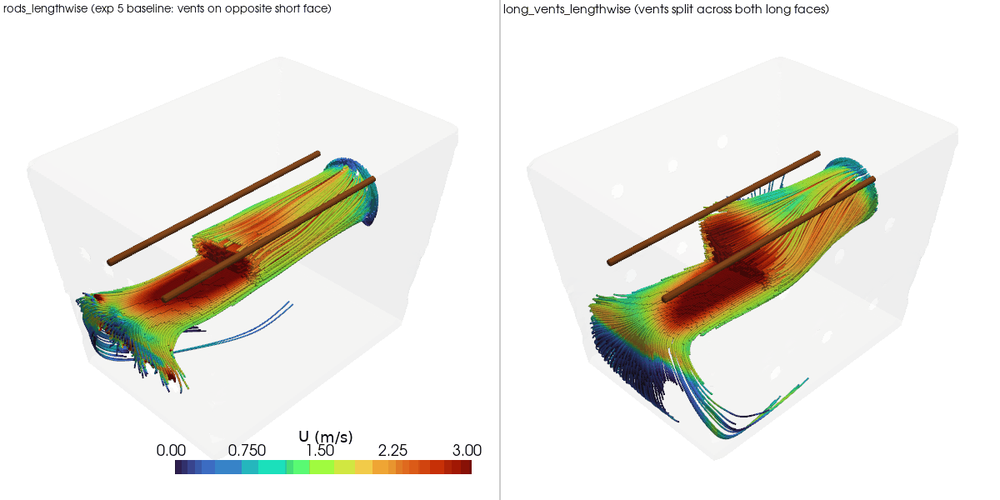

# Experiment 7: fan on short face + rods lengthwise + vents on long faces, combined

**Question:** experiments 5 and 6 each changed one thing about experiment
4's end_mount (fan on the -x short face) in isolation - experiment 5
rotated the rods to run lengthwise, experiment 6 moved the vents onto both
long faces. Both changes act on the same axis (the jet's centerline, y=0):
experiment 5 found lengthwise rods end up flanking that centerline instead
of crossing it, and experiment 6 found relocating the vents forces the
jet to spread sideways toward y = +-half_W to reach its new exits. Does
stacking both changes together - lengthwise rods *and* long-face vents -
do better than either change alone, now that the flow this pattern has to
fill is genuinely different from either single-variable test?

- `rods_lengthwise` - exp 5's variant, reused as-is (not re-solved): fan on
  the -x short face, rods lengthwise at two y positions, all 12 vents
  consolidated on the opposite +x short face
- `long_vents_lengthwise` - identical fan and rods, but the 12 vents move
  off the opposite short face and split 6-and-6 across both long faces
  instead - exp 6's vent change applied on top of exp 5's rod change,
  instead of exp 4's crosswise rods. Vent placement is the only variable
  relative to rods_lengthwise; rod orientation is the only variable
  relative to exp 6's long_face_vents.

## Finding: a big win over rods_lengthwise, but not better than exp 6's crosswise result - lengthwise rods don't add anything once the vents are already on the long faces

| metric | rods_lengthwise (exp 5 baseline) | long_vents_lengthwise | exp 6's long_face_vents (crosswise rods, for reference) |
|---|---|---|---|
| mean speed at rod/meat surface | 0.685 m/s | **1.009 m/s (+47%)** | 1.012 m/s |
| min speed at rod/meat surface | 0.036 m/s | 0.046 m/s (+30%) | 0.072 m/s |
| std dev at rod/meat surface (lower = more even along the rod) | 0.538 m/s | 0.601 m/s (+12%) | 0.722 m/s |
| mean speed, full cross-section at rod height | 0.445 m/s | **0.736 m/s (+65%)** | 0.820 m/s |
| uniformity (CV, lower = more even) | 0.821 | **0.704 (-14%, more even)** | 0.601 |
| internal gauge pressure (mean / max) | 13.9 / 20.6 Pa | 17.7 / 25.5 Pa (+27% / +24%) | 17.7 / 25.2 Pa |

Relocating the vents onto both long faces is again a large, mostly-clean
win over its own baseline - rod-surface mean speed up 47%, full
cross-section mean up 65%, better uniformity, higher protective pressure -
essentially the same story experiment 6 already told for crosswise rods.

But the interesting result is the **middle column vs the right column**:
stacking lengthwise rods on top of the vent relocation does not beat
keeping the rods crosswise. long_face_vents (crosswise) edges out
long_vents_lengthwise on every metric except one - rod-surface mean speed
is a statistical tie (1.012 vs 1.009 m/s, well within this project's noise
floor), but long_face_vents has a higher minimum (0.072 vs 0.046 m/s), a
higher full cross-section mean (0.820 vs 0.736 m/s), and better whole-box
uniformity (CV 0.601 vs 0.704). The only metric where lengthwise rods do
better is the std dev *along a single rod's own surface* (0.601 vs 0.722,
i.e. more even from end to end of each rod) - the same axis where
experiment 5 found lengthwise rods help, in isolation, at the cost of
everything else.

**Why:** the rod-height slice (`results/rod_height_slice.png`) shows that
once the vents are on the long faces, the flow has to spread toward both
side walls to find an exit either way - that's what both variants'
high-speed patches near each long-face vent cluster in the image show.
Crosswise rods, spanning the full width at a fixed x, sit directly in the
path of that lateral spread and get hit broadside by more of it; lengthwise
rods, positioned at fixed y offsets, only intercept whichever part of the
spreading flow happens to reach their own y position. In other words, the
mechanism that made lengthwise rods a mixed bag in experiment 5 (flanking
the jet's core instead of crossing it) doesn't reverse itself just because
the vents moved - it's still true here, just measured against a
wider-spreading flow instead of a narrow jet.

**Caveat worth flagging:** as with every case in this project, neither run
converged to the solver's target residual before hitting the
500-iteration cap, and the rod-surface mean-speed "tie" between this
variant and exp 6's long_face_vents (1.009 vs 1.012 m/s, a 0.3% gap) is
well inside that noise floor - treat it as indistinguishable, not as
evidence lengthwise rods are exactly as good. The metrics that do
consistently favor long_face_vents (min speed, full cross-section mean,
uniformity) are each 10%+ gaps, larger than the scatter seen elsewhere in
this project, so those differences are more likely to be real.

**Recommendation:** if the vent-on-long-faces idea is ever pursued, keep
the rods crosswise (exp 6's long_face_vents) rather than rotating them to
lengthwise - the combination tested here doesn't earn its added complexity.
This also answers the motivating question directly: the two single-variable
wins do **not** stack into a bigger combined win - once the flow is
already forced to spread sideways by the vent relocation, rod orientation
stops mattering much, and if anything crosswise is still very slightly
better across more metrics.

## View the results (rendered)

`results/rod_height_slice.png` shows both vent-relocated variants filling
much more of the cross-section than rods_lengthwise's baseline - the
lengthwise-rod change on top of that doesn't visibly change the picture
much.



## Reproduce

```
blender --background --python generate_geometry_v2.py   # writes stl_out/long_vents_lengthwise/
python3 setup_cfd_cases.py                                # writes case-long-vents-lengthwise/
./run_cfd.sh long_vents_lengthwise                         # mesh + solve (~6-10 min)
./compare.sh                                                # writes results/ (reuses exp5's rods_lengthwise, no re-solve)
```
(`compare.sh`/`view.sh` find the shared `.venv` automatically - run them
from anywhere, no activation or path-remembering needed)

## View the results

Same pattern as previous experiments: static PNGs in `results/`, or
```
./view.sh all
```

To generate a rotating GIF (e.g. for embedding in a GitHub README, which
can't render the interactive viewer):
```
./make_gif.sh                      # writes results/streamlines.gif
./make_gif.sh rods                 # orbit the rod-height slice instead
./make_gif.sh slice --frames 90 --fps 15   # faster playback, bigger file
```
Default is 7.5fps (deliberately slow, easier to follow the rotation);
pass `--fps` to override.

## Files

```
generate_geometry_v2.py    Blender geometry generator -> stl_out/long_vents_lengthwise/*.stl
setup_cfd_cases.py         writes OpenFOAM case files (0/, constant/, system/) + copies STLs
run_cfd.sh                 blockMesh -> snappyHexMesh -> checkMesh -> simpleFoam, via Docker
compare_variants.py        metrics + comparison renders -> results/
compare.sh                 wrapper: runs compare_variants.py with the shared .venv, from anywhere
view_interactive.py        interactive viewer (reuses compare_variants.py's helpers)
view.sh                    wrapper: runs view_interactive.py with the shared .venv, from anywhere
make_gif.py                orbiting-camera GIF export (for GitHub embedding) -> results/*.gif
make_gif.sh                wrapper: runs make_gif.py with the shared .venv, from anywhere
stl_out/                   geometry STLs for long_vents_lengthwise (walls/fan/outlet/rods patches)
case-long-vents-lengthwise/ OpenFOAM case for long_vents_lengthwise (mesh + solution, regenerable)
results/                   metrics.csv + comparison PNGs
```
