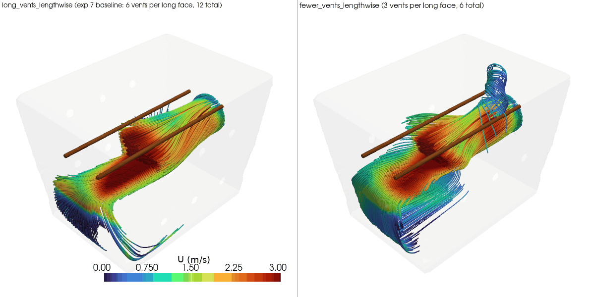

# Experiment 8: fewer vent holes - 3 per long face instead of 6

**Question:** experiment 7's `long_vents_lengthwise` is this project's
recommended configuration, but it needs 12 vent holes drilled across two
faces (6 per face, a 2x3 grid) - more fiddly to drill accurately into an
IKEA SAMLA tote than fewer holes would be. Does cutting the vent count in
half (3 per face, a single row of 3, 6 total) cost anything in cooling
airflow, or was 12 holes more than the flow actually needed?

- `long_vents_lengthwise` - exp 7's variant, reused as-is (not re-solved):
  fan on the -x short face, rods lengthwise, 6 vents per long face (2
  rows x 3 cols, 12 total), 15mm holes.
- `fewer_vents_lengthwise` - identical fan and rods, but each long face
  drops to 3 vents (1 row x 3 cols, centered at mid-height instead of two
  rows), 6 total, same 15mm hole diameter. Vent count is the only
  variable.

## Finding: airflow barely changes, but internal back-pressure roughly quadruples - a real cost this project's CFD setup mostly hides

| metric | long_vents_lengthwise (exp 7 baseline) | fewer_vents_lengthwise (half the holes) |
|---|---|---|
| mean speed at rod/meat surface | 1.009 m/s | 0.968 m/s (-4%) |
| min speed at rod/meat surface | 0.046 m/s | 0.120 m/s (+159%) |
| std dev at rod/meat surface (lower = more even along the rod) | 0.601 m/s | 0.459 m/s (-24%, more even) |
| mean speed, full cross-section at rod height | 0.736 m/s | 0.721 m/s (-2%) |
| uniformity (CV, lower = more even) | 0.704 | 0.600 (-15%, more even) |
| internal gauge pressure (mean / max) | 17.7 / 25.5 Pa | **66.1 / 70.6 Pa (+273% / +177%)** |

Judged purely by the velocity numbers this project has used to rank every
other configuration, 6 holes look like a clean win over 12: mean
rod-surface speed drops only 4%, and the minimum speed, per-rod std dev,
and whole-box uniformity all get *better*. If airflow speed were the only
thing that mattered, fewer holes would be the easy call.

But internal gauge pressure jumps from 17.7 Pa (mean) to 66.1 Pa - a 3.7x
increase - and the peak goes from 25.5 to 70.6 Pa, a 2.8x increase. That's
the textbook signature of orifice flow: for a given volumetric flow rate,
halving the total open vent area roughly doubles the average velocity
forced through each remaining hole, and dynamic pressure loss scales with
velocity *squared* - so a ~2x velocity increase through the vents produces
close to a 4x pressure penalty, almost exactly what's observed here.

**Why this matters even though the velocity metrics look fine:** every
case in this project models the fan as a fixed-velocity inlet boundary
condition (3.679 m/s, derived from a 30 CFM "free-air" fan rating - see
`setup_cfd_cases.py`), applied regardless of how much resistance sits
downstream. Real fans don't work that way: a fan's actual flow output
falls as the back-pressure it has to push against rises (its fan curve),
and "free-air CFM" ratings specifically describe performance at *zero*
back-pressure. 66 Pa is far higher than the back-pressure any other
configuration in this project has ever produced (the previous high was
25.5 Pa, in exp7 itself) - a serious ask for a fan whose spec sheet
advertises free-air CFM rather than static pressure. In other words, this
simulation answers "if the fan really did blow at 3.679 m/s no matter
what, would 6 holes flow enough air" - but the honest answer to the real
question ("would a real 30 CFM PC fan still deliver anything close to
this once it's fighting 66 Pa of back-pressure") is very likely no. The
velocity numbers in the table above are therefore optimistic for
`fewer_vents_lengthwise` in a way they aren't for any of this project's
other experiments, because none of those pushed the back-pressure far
enough to plausibly break the fixed-fan-speed assumption.

The renders back this up structurally, not just numerically:
`results/rod_height_slice.png` shows `fewer_vents_lengthwise`'s flow is
actually a bit calmer and more evenly spread than exp7's (matching the
better CV), and `results/streamlines.png` shows the exit flow bunching
into a tighter, more twisted knot near each of the now-fewer vent
clusters - visibly higher exit velocity being forced through fewer exit
points, exactly the mechanism behind the pressure jump.

**Caveat:** as with every case in this project, neither run converged to
the solver's target residual before hitting the 500-iteration cap; mass
balance error is 14-19% for both runs (see `results/metrics.csv`),
consistent with the noise floor already characterized in prior
experiments. The velocity-metric differences here (a few percent either
way) are within that noise and shouldn't be over-read - the pressure
difference (3-4x) is far outside it and is the real finding here.

**Recommendation:** don't build this configuration as-is. Even though the
on-paper airflow numbers look fine or better, the back-pressure
requirement likely exceeds what this project's assumed fan can actually
deliver, which would make real-world airflow worse than simulated, not
equal to it. See experiment 9, which tests whether enlarging the
remaining 6 holes to recover the lost open area fixes the pressure
problem while keeping the buildability win of fewer holes to drill.

## View the results (rendered)

`results/rod_height_slice.png` shows fewer_vents_lengthwise's flow is
calmer and more evenly spread than exp7's, not visibly worse - the
pressure problem shown in the metrics table isn't obvious from the
velocity picture alone, which is exactly why it's easy to miss.



## Reproduce

```
blender --background --python generate_geometry_v2.py   # writes stl_out/fewer_vents_lengthwise/
python3 setup_cfd_cases.py                                # writes case-fewer-vents-lengthwise/
./run_cfd.sh fewer_vents_lengthwise                        # mesh + solve (~6-10 min)
./compare.sh                                                # writes results/ (reuses exp7's long_vents_lengthwise, no re-solve)
```
(`compare.sh`/`view.sh` find the shared `.venv` automatically - run them
from anywhere, no activation or path-remembering needed)

## View the results

Same pattern as previous experiments: static PNGs in `results/`, or
```
./view.sh all
```

To generate a rotating GIF (e.g. for embedding in a GitHub README, which
can't render the interactive viewer):
```
./make_gif.sh                      # writes results/streamlines.gif
./make_gif.sh rods                 # orbit the rod-height slice instead
./make_gif.sh slice --frames 90 --fps 15   # faster playback, bigger file
```
Default is 7.5fps (deliberately slow, easier to follow the rotation);
pass `--fps` to override.

## Files

```
generate_geometry_v2.py    Blender geometry generator -> stl_out/fewer_vents_lengthwise/*.stl
setup_cfd_cases.py         writes OpenFOAM case files (0/, constant/, system/) + copies STLs
run_cfd.sh                 blockMesh -> snappyHexMesh -> checkMesh -> simpleFoam, via Docker
compare_variants.py        metrics + comparison renders -> results/
compare.sh                 wrapper: runs compare_variants.py with the shared .venv, from anywhere
view_interactive.py        interactive viewer (reuses compare_variants.py's helpers)
view.sh                    wrapper: runs view_interactive.py with the shared .venv, from anywhere
make_gif.py                orbiting-camera GIF export (for GitHub embedding) -> results/*.gif
make_gif.sh                wrapper: runs make_gif.py with the shared .venv, from anywhere
stl_out/                   geometry STLs for fewer_vents_lengthwise (walls/fan/outlet/rods patches)
case-fewer-vents-lengthwise/ OpenFOAM case for fewer_vents_lengthwise (mesh + solution, regenerable)
results/                   metrics.csv + comparison PNGs
```
