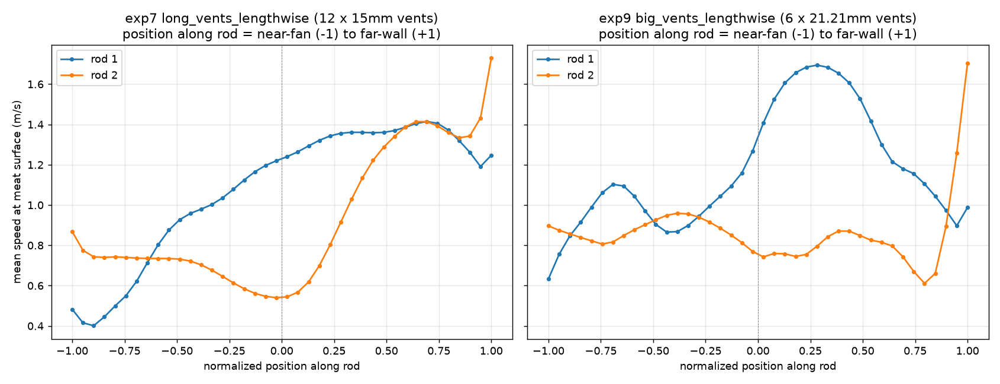
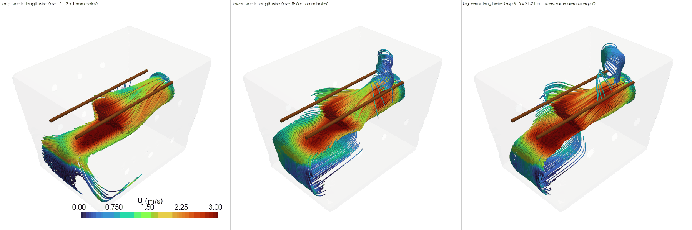

# Experiment 9: same 6 vent holes as experiment 8, but sized to match experiment 7's total open area

**Question:** experiment 8 cut vent count from 12 (exp 7's recommended
layout) to 6 by removing one row of holes per long face, and found
airflow barely changed but internal back-pressure roughly quadrupled - a
real problem, since this project's fan is modeled as a fixed-velocity, 30
CFM *free-air* source that likely can't sustain that much back-pressure in
reality (see exp 8's README). The orifice-flow mechanism behind that
pressure jump is well understood: halving open area roughly doubles the
velocity forced through each hole, and dynamic pressure loss scales with
velocity squared. So: if each of exp 8's 6 holes is enlarged just enough
to restore the *original total open area* (12 holes at 15mm diameter = 6
holes at 15mm x sqrt(2) = 21.21mm diameter), does that recover exp 7's
pressure while keeping the buildability win of only 6 holes to drill?

- `long_vents_lengthwise` - exp 7's variant, reused as-is (not re-solved):
  12 x 15mm vents (6 per long face). Total open vent area ~ 2121 mm^2.
- `fewer_vents_lengthwise` - exp 8's variant, reused as-is (not
  re-solved): 6 x 15mm vents (3 per long face) - half the open area of
  exp 7, same hole count/positions as this experiment.
- `big_vents_lengthwise` - this experiment: 6 x 21.21mm vents (3 per long
  face, same count/positions as exp 8), diameter scaled by sqrt(2) so
  total open area matches exp 7's exactly. Vent diameter is the only
  variable relative to exp 8; vent count is the only variable relative to
  exp 7.

## Finding: the theory held almost exactly - exp9 matches or beats exp7 on every pooled metric, at half the hole count

| metric | long_vents_lengthwise (exp 7, 12 holes) | fewer_vents_lengthwise (exp 8, 6 holes, same dia) | big_vents_lengthwise (exp 9, 6 holes, bigger dia) |
|---|---|---|---|
| mean speed at rod/meat surface | 1.009 m/s | 0.968 m/s | **1.021 m/s** |
| min speed at rod/meat surface | 0.046 m/s | 0.120 m/s | **0.273 m/s** |
| std dev at rod/meat surface (lower = more even) | 0.601 m/s | 0.459 m/s | 0.491 m/s |
| mean speed, full cross-section at rod height | 0.736 m/s | 0.721 m/s | **0.757 m/s** |
| uniformity (CV, lower = more even) | 0.704 | 0.600 | 0.610 |
| internal gauge pressure (mean / max) | 17.7 / 25.5 Pa | 66.1 / 70.6 Pa | **20.1 / 25.2 Pa** |

Every worry raised in exp 8 evaporates: internal pressure comes back down
to 20.1 Pa mean / 25.2 Pa max - essentially identical to exp 7's 17.7 /
25.5 Pa (the peak is actually very slightly *lower*) - confirming the
orifice-flow theory almost exactly: doubling the area per hole undoes
almost exactly the pressure penalty from having half as many holes. And
rod-surface mean speed, minimum speed, full cross-section mean, and
uniformity all come out *better* than exp 7's, not just tied: mean speed
+1.2%, full cross-section mean +2.9%, uniformity 13% better, and the
minimum rod-surface speed jumps nearly 6x (0.046 -> 0.273 m/s) - the
biggest single improvement of any metric in this comparison. The only
metric that doesn't outright win is rod-surface std dev (0.491 vs exp 7's
0.601 - still better than exp 7, but 7% worse than exp 8's 0.459) - a
minor, expected trade against exp 8 specifically, not against exp 7.

At face value this makes `big_vents_lengthwise` a strict upgrade over exp
7's recommended layout: same or better airflow on every pooled metric,
near-identical (in fact very slightly lower peak) back-pressure, and only
6 holes to drill instead of 12.

## Follow-up: does the along-rod profile still favor "one end" over "the middle"?

Experiment 7 was recommended over exp 6's `long_face_vents` specifically
because pooled metrics hide *where* along a rod the slow spots sit - exp
6's crosswise rods had a dead zone in the middle of every rod (bad no
matter how hooks are spaced), while exp 7's lengthwise rods pushed that
dead zone to one predictable end. Since exp 9 wins on pooled metrics the
same way exp 6 did, the same check is worth re-running here before
trusting the pooled numbers alone: `rod_profile_compare.py` samples mean
speed in rings at 40 positions along each rod for exp 7 and exp 9 (both
lengthwise rods, so this is a straight rescan, not a reinterpretation of
axes):



The shapes are not simply "the same, but shifted up" - exp 9's profile is
more oscillatory than exp 7's fairly clean "slow near the fan, flat
plateau elsewhere" climb:

- **exp 7:** rod 1 climbs mostly monotonically from ~0.40 m/s near the fan
  to a ~1.35-1.4 m/s plateau across the back 60% of its length. Rod 2 dips
  to its lowest point (~0.54 m/s) around the box's *centerline*, not an
  end, before climbing to ~1.4 m/s near the far wall and spiking to 1.7
  m/s right at the tip.
- **exp 9:** rod 1 has a local peak (~1.1 m/s) a third of the way in, dips
  back to ~0.86 m/s past the centerline, then climbs to a pronounced peak
  (~1.75 m/s) about a third of the way past center, before easing back
  down to ~0.9-1.0 m/s toward the far wall. Rod 2 stays in a fairly narrow
  0.75-0.95 m/s band for roughly 80% of its length (from just past the
  near-fan end through to about 80% of the way toward the far wall), dips
  to its lowest point (~0.61 m/s) close to - but not at - the far end,
  then spikes to 1.7 m/s right at the tip.

So exp 9 does **not** cleanly preserve exp 7's "avoid one end" simplicity
- its cold spots are more spread out across the rod's middle two-thirds
rather than confined to one 15-20% stretch. But the practically important
number is the *floor*: exp 9's worst point on either rod (~0.61-0.63 m/s)
is meaningfully higher than exp 7's worst point (~0.40-0.54 m/s) - the
same "min speed" improvement the pooled table already showed, just
visible here as "no position on either rod gets anywhere near as cold as
exp 7's coldest spot," rather than as one big single-number win. For
hook-loading specifically, that means exp 9 trades a simple-to-describe
failure mode (avoid the last 15-20% near the fan) for a harder-to-describe
one (avoid several shorter, less predictable stretches) - but the
worst-case airflow at any hook position is still higher across the board.

**Caveat:** only 2 rods x 2 configurations were sampled here, same as exp
7's original follow-up - not enough to generalize the exact shape of the
oscillation, only that it exists and that the floor is higher. As with
every case in this project, neither run converged to the solver's target
residual before the 500-iteration cap; mass balance error is 14.2-14.5%
for both exp 7 and exp 9 (within this project's established noise floor -
exp 8's 18.7% imbalance doesn't apply here, since exp 9's mesh/solve
behaved like every other case in this project, not like exp 8's
pressure-stressed one).

**Recommendation:** `big_vents_lengthwise` (this experiment) is the new
best configuration by every pooled metric this project tracks, and it
does so with the same buildability advantage exp 8 was chasing (6 holes
instead of 12) without exp 8's back-pressure problem. The one open
question is whether the more oscillatory along-rod profile matters in
practice for hook placement - since the floor is higher everywhere
despite the less predictable shape, there's no position on either rod
that's worse than the *worst* position on exp 7's rods, so this shouldn't
be read as a reason to prefer exp 7 over exp 9, only as a note that "avoid
the last 20% near the fan" (exp 7's simple rule) doesn't transfer directly
to this configuration - hook placement along `big_vents_lengthwise`'s rods
doesn't have as clean a rule of thumb.

## View the results (rendered)

`results/rod_height_slice.png` shows `big_vents_lengthwise`'s
cross-section looks similar in character to `fewer_vents_lengthwise`'s
(calmer, more evenly spread than exp 7's tighter hot patches near the
vents), and `results/streamlines.png` shows a similarly tightened exit
knot to exp 8's near the fewer vent clusters - despite that visual
similarity to exp 8, the metrics land closer to exp 7's than exp 8's on
pressure, and beat both on speed.



## Reproduce

```
blender --background --python generate_geometry_v2.py   # writes stl_out/big_vents_lengthwise/
python3 setup_cfd_cases.py                                # writes case-big-vents-lengthwise/
./run_cfd.sh big_vents_lengthwise                          # mesh + solve (~6-10 min)
./compare.sh                                                # writes results/ (reuses exp7 + exp8, no re-solve)
../../.venv/bin/python rod_profile_compare.py               # writes results/rod_profile_along_length.png (exp7 vs exp9)
```
(`compare.sh`/`view.sh` find the shared `.venv` automatically - run them
from anywhere, no activation or path-remembering needed)

## View the results

Same pattern as previous experiments: static PNGs in `results/`, or
```
./view.sh all
```

To generate a rotating GIF (e.g. for embedding in a GitHub README, which
can't render the interactive viewer):
```
./make_gif.sh                      # writes results/streamlines.gif
./make_gif.sh rods                 # orbit the rod-height slice instead
./make_gif.sh slice --frames 90 --fps 15   # faster playback, bigger file
```
Default is 7.5fps (deliberately slow, easier to follow the rotation);
pass `--fps` to override. This experiment's comparisons render 3 variants
side by side (exp 7, exp 8, exp 9) instead of the usual 2.

## Files

```
generate_geometry_v2.py    Blender geometry generator -> stl_out/big_vents_lengthwise/*.stl
setup_cfd_cases.py         writes OpenFOAM case files (0/, constant/, system/) + copies STLs
run_cfd.sh                 blockMesh -> snappyHexMesh -> checkMesh -> simpleFoam, via Docker
compare_variants.py        metrics + comparison renders (3-way: exp7/exp8/exp9) -> results/
compare.sh                 wrapper: runs compare_variants.py with the shared .venv, from anywhere
rod_profile_compare.py     speed-vs-position-along-rod plot, exp7 vs exp9 -> results/rod_profile_along_length.png
view_interactive.py        interactive viewer (reuses compare_variants.py's helpers)
view.sh                    wrapper: runs view_interactive.py with the shared .venv, from anywhere
make_gif.py                orbiting-camera GIF export (for GitHub embedding) -> results/*.gif
make_gif.sh                wrapper: runs make_gif.py with the shared .venv, from anywhere
stl_out/                   geometry STLs for big_vents_lengthwise (walls/fan/outlet/rods patches)
case-big-vents-lengthwise/ OpenFOAM case for big_vents_lengthwise (mesh + solution, regenerable)
results/                   metrics.csv + comparison PNGs + rod_profile_along_length.png
```
